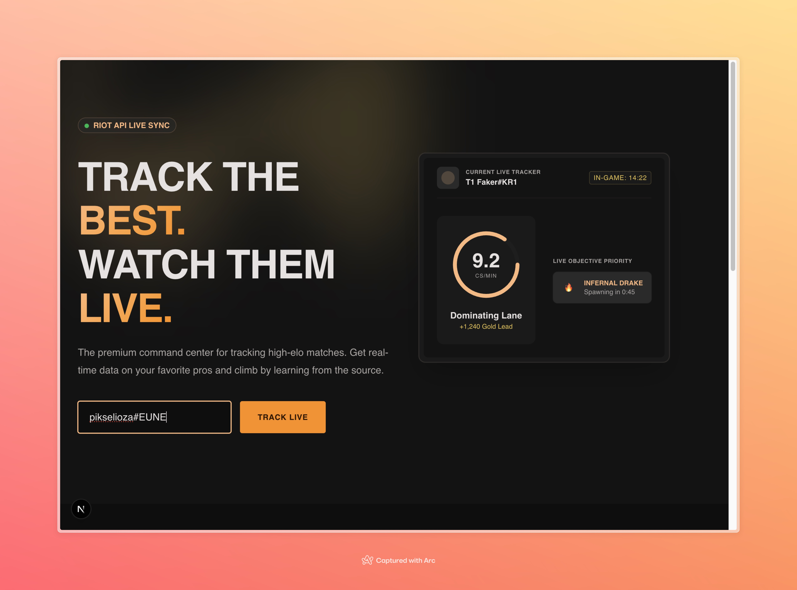
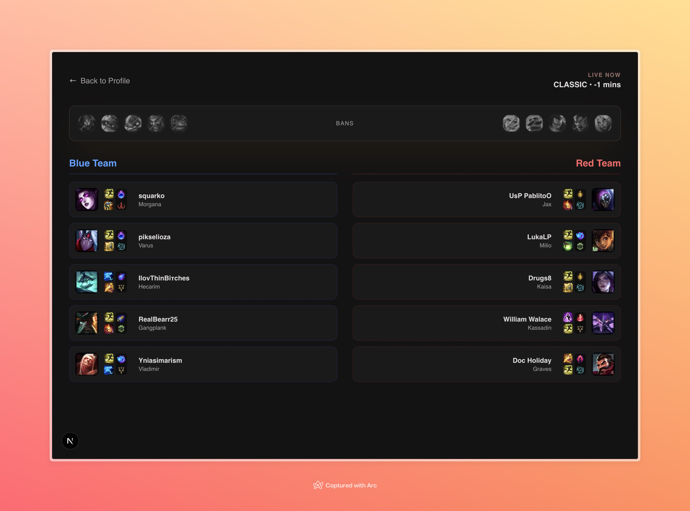

# Nexus - League of Legends Live Match Tracker

A cutting-edge real-time League of Legends match analytics platform built with [Next.js](https://nextjs.org), React, and TypeScript. Track live games, monitor pro players, and dive deep into performance metrics as they happen.

## 🎮 About Nexus

Nexus provides instant access to League of Legends competitive play with three core features:

- **Live Match Feed** - Monitor ongoing matches in real-time with gold leads, objective control, and power spike tracking
- **Pro Scout** - Follow your favorite professional and high-elo players, get instant notifications when they start playing, and track their build paths live
- **Performance Metrics** - Deep-dive into comprehensive live statistics and compare current performance against historical averages

## 📸 Screenshots

### Home Page



### Live Match Dashboard



## 🚀 Getting Started

### Prerequisites

- Node.js 18+ and npm/yarn/pnpm installed

### Installation

1. Clone the repository
2. Install dependencies:

```bash
npm install
```

## 📋 Available Scripts

### Development

```bash
npm run dev
```

Starts the development server at [http://localhost:3000](http://localhost:3000). The app will hot-reload as you make changes.

### Production

```bash
npm run build
```

Creates an optimized production build.

```bash
npm run start
```

Runs the production server.

### Testing & Quality

```bash
npm run test
```

Runs all tests with Vitest. Includes unit tests and component tests with React Testing Library.

```bash
npm run lint
```

Runs ESLint to check code quality and style violations.

```bash
npm run format
```

Formats all code using Prettier for consistent styling.

```bash
npm run format:check
```

Checks if code is properly formatted without making changes.

### Storybook

```bash
npm run storybook
```

Launches Storybook at [http://localhost:6006](http://localhost:6006) for component development and testing.

```bash
npm run build-storybook
```

Builds a static Storybook instance for deployment.

## 🛠️ Tech Stack

- **Framework**: Next.js 16.2.1 with App Router
- **Frontend**: React 19.2.4, TypeScript 5
- **Styling**: Tailwind CSS 4
- **Testing**: Vitest, React Testing Library, Playwright
- **Components**: Storybook with addon-vitest integration
- **Code Quality**: ESLint, Prettier
- **Type Safety**: TypeScript with strict mode

## 🌐 Deployed Application

Visit the live application: [https://nexus-web-next.vercel.app](https://nexus-web-next.vercel.app)

## 📁 Project Structure

```
app/
├── api/                    # API routes (getMatch, getPlayer)
├── live/[puuid]/          # Live match pages
├── summoner/[id]/         # Summoner profile pages
└── page.tsx               # Home page

components/               # Reusable React components
├── BanList.tsx
├── LivePlayerCard.tsx
└── *.stories.tsx          # Storybook stories
```

## 🏗️ Learn More

- [Next.js Documentation](https://nextjs.org/docs)
- [React Documentation](https://react.dev)
- [Tailwind CSS](https://tailwindcss.com)
- [Vitest](https://vitest.dev)
- [Storybook](https://storybook.js.org)

## 📝 License

This project is open source and available for personal and educational use.
